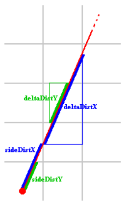

# Cube3D

## Definitions

- **DDA**:

## DDA

- **position**: Green dot in Image1
- **Direction vector**: (black line) A vector showing the direction the player is looking to
- **Camera plane vector**: (blue line) A vector, that represens the surface of the camera screen. ector, that is perpendicular (90 degrees) to the direction plane
- **(rayDir)**: *(red lines) The ray direction vectors are used by the DDA algorithm and are calculated like : pos + dir + (plane * distance on plane)
- **FOV**: The field of vision is in between the two outer most rays.

## Game view:

- **Player rotation**: When the player rotates, the dir and the plane have to rotate as well, the rays will automatically rotate as well. For the rotation the vector needs to be multiplied with the rotation matrix

Check List submission:

- [] norminette
- [] memory leaks
	- [] fsanitize
	- [] valgrind
- [] check direction of textures
- [] texture files
	- [] not 64 x 64
	- [] character inside that is not a defined colour
	- [] missing characters
	- [] no content in file
	- [] wrong file type (not xpm etc)
- [] maps
	- [] walls  ot completely surrounding
	- [] invalid character
	- [] no player
	- [] only wall and player (no 0s)

